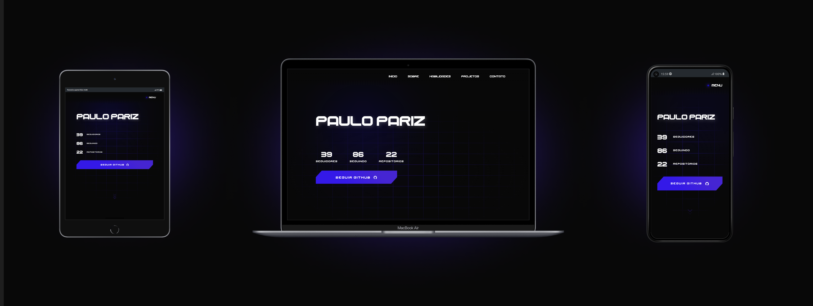

<h2 align="center">PORTFÓLIO - PAULO PARIZ(fora do ar)</h2>

 

O <a href="https://paulopariz.vercel.app/">portfólio</a> exibe informações sobre mim, minhas habilidades, alguns projetos em destaque e um formulário para contato. Desenvolvido com VueJS, Tailwind e SASS para os estilos, entre outras bibliotecas!

 

  

https://user-images.githubusercontent.com/111146928/216165956-76b7e272-5128-4875-bc9a-7e5d309d47da.mp4

 

https://user-images.githubusercontent.com/111146928/216166156-ae6ecb62-d0be-476c-8f96-d5b6517df875.mp4

  

## ⚡ MAIS SOBRE O PROJETO:
- Responsivo para diversos aparelhos, com os breakpoints do Tailwind.
- Api do Github utilizada para exibir: Nome, Seguidores, Seguindo e Reposiórios.
- Componentes organizados em pastas com o arquivo .vue / .scss
- Variáveis de cores com SASS.
- ETC...

 

## 🛠️ TECNOLOGIAS / BIBLIOTECAS UTILIZADAS:

 

|              |                                                   |
| :----------------: | :---------------------------------------------------: |
|         |    `VUEJS`   |
|         |    `JAVASCRIPT`   |
|         |    `SASS`   |
|         |    `TAILWIND`   |
|         |    `MOMENTJS`   |
|         |    `AXIOS`   |
|         |    `AOS - ANIMATE`   |
|         |    `ANIMATE CSS`   |

  

## 📍 DEPLOY:
- <a href="https://paulopariz.vercel.app/">CLIQUE AQUI PARA VER O PROJETO</a>

 

## 🧠 Autor

- [@paulopariz](https://www.linkedin.com/in/paulopariz/)

  

<h2 align="center">Contato:</h2>

    

 

